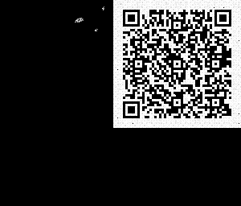

# welcome

```
score: 392
solved: 27/27
difficulty: hard
tags: misc, mp4, video, qrcode, opencv
```

## Problem
Welcome to SEETF! Submit the teaser video flag here.

https://www.youtube.com/watch?v=0GVC30jiwJs

Download: https://drive.google.com/file/d/1Dlfp6vC1pto7vW5WUKqvX-tbIt6tfGfg/view

## Got the flag
The welcome video uploaded to YouTube even before the CTF start.
After watched the video, we noticed from 00:25, there are white dot in a
square box on the top right of the video till the end.
The square seems nicely fit a QRCode, so the task would be get all the white
dot to form a QRcode picture.

Extracts frames from video downloaded from Google drive link [with ffmpeg](https://stackoverflow.com/a/66524095/807703)

```
ffmpeg -i input.mp4 '%04d.png'
```

this creates ~ 4000 png files and the dot starts appears at ~ 1620.png.

The idea is to use opencv to crop each image in a big-enough square, as each
of them is a numpy matrix, they can be added together, in the end, we will
have all the white-dots and that is the QRcode.

The naive implementation returned a noise image:

```py
import os
import cv2
images = sorted(os.listdir())[1620:]
acc = cv2.imread(images[0], cv2.IMREAD_GRAYSCALE)[:256,1620:]
for img in images:
    tmp = cv2.imread(x, cv2.IMREAD_GRAYSCALE)[:256,1620:]
    acc += tmp

cv2.imwrite("result.png", acc)
```

After examines several images, we the black areas is not absolute black, so all
the gray pixel add up (1, 2...) we end up with a white pixel (as we exams ~ 2400 images).
From 00:31 to 00:35, there are even pretty white background video. We convert all
values < 200 to 0, then remain only real white dots.
Add up, after ~ 1 min, we got the QRcode, scanned it, got the flag.

```py
import os
import cv2

images = sorted(os.listdir("welcome"))[1620:]
i = cv2.imread("welcome/4391.png", cv2.IMREAD_GRAYSCALE)
i = i[:256, 1620:]
i[i < 200] = 0

for x in images:
    print(x, end=" ")
    tmp = cv2.imread("welcome/" + x, cv2.IMREAD_GRAYSCALE)[:256, 1620:]
    tmp[tmp < 200] = 0
    i += tmp

cv2.imwrite("welcome.png", i)
```


